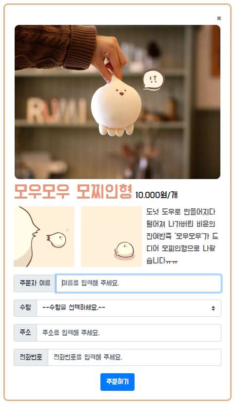
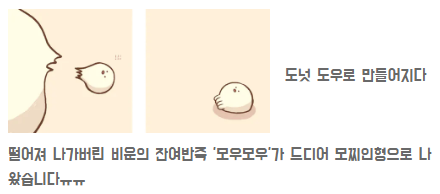

# 첫 과제: shopping

## 결과물

### 1주차
---

> 

### 2주차
---

> 

## 문제점

---

### 1주차

> #### 1. 이미지 옆에 텍스트 넣기
>
> >     
> > 수업시간에 배운 span 태그를 이용해 이미지의 오른편에 글을 쓰고자 했으나 위와 같이 한 줄만 이미지의 오른편에 위치하고 나머지 줄들은 이미지의 아래로 내려가버리는 문제가 발생했다. 구글링을 통해 태그에 float를 추가하면 영역과 영역을 나란히 붙일 수 있다는 것을 알게 되었다. 이미지에 float: left; 를 추가해 문제를 해결했다. 또한 영역과 영역을 구분하기 위해 이미지의 오른쪽 여백을 설정했다. margin-right를 이용했다.

```html
<p>
  
  <span style="color: dimgray; font-size: 18px;">
    도넛 도우로 만들어지다 떨어져 나가버린 비운의 잔여반죽 '모우모우'가 드디어
    모찌인형으로 나왔습니다ㅠㅠ
  </span>
</p>
```

> #### 2. 주문하기 버튼 가운데 정렬
>
> > 맨 아래에 위치한 주문하기 버튼을 가운데 정렬 하기 위해 text-center 이라는 클래스를 부여했다.

```html
<div class="text-center">
  <button type="button" class="btn btn-primary">주문하기</button>
</div>
```

### 2주차

> #### 1. 
>
> >

