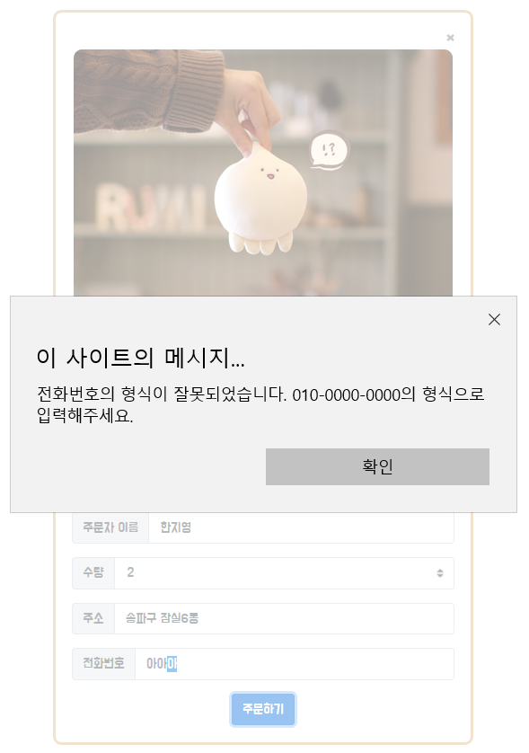

# 첫 과제: shopping

## 결과물

### 1주차

---

> 

### 2주차

---

> 

## 문제점

---

### 1주차

> #### 1. 이미지 옆에 텍스트 넣기
>
> >     
> > 수업시간에 배운 span 태그를 이용해 이미지의 오른편에 글을 쓰고자 했으나 위와 같이 한 줄만 이미지의 오른편에 위치하고 나머지 줄들은 이미지의 아래로 내려가버리는 문제가 발생했다. 구글링을 통해 태그에 float를 추가하면 영역과 영역을 나란히 붙일 수 있다는 것을 알게 되었다. 이미지에 float: left; 를 추가해 문제를 해결했다. 또한 영역과 영역을 구분하기 위해 이미지의 오른쪽 여백을 설정했다. margin-right를 이용했다.

```html
<p>
  
  <span style="color: dimgray; font-size: 18px;">
    도넛 도우로 만들어지다 떨어져 나가버린 비운의 잔여반죽 '모우모우'가 드디어
    모찌인형으로 나왔습니다ㅠㅠ
  </span>
</p>
```

> #### 2. 주문하기 버튼 가운데 정렬
>
> > 맨 아래에 위치한 주문하기 버튼을 가운데 정렬 하기 위해 text-center 이라는 클래스를 부여했다.

```html
<div class="text-center">
  <button type="button" class="btn btn-primary">주문하기</button>
</div>
```

### 2주차

> #### 1. 버튼을 누르면 경고창이? (onclick)
>
> > body에 작성해 놓은 button태그에 onclick를 주어서 버튼을 클릭할 경우 함수가 실행되도록 한다. onclick="buttonalert()". buttonalert는 내가 자바스크립트로 정의할 함수명이다.

```html
<button type="button" onclick="buttonalert()" class="btn btn-primary">
  주문하기
</button>
```

> > 함수는 head의 script 안에 정의한다. function 함수명() {실행내용}.

> #### 2. jquery로 input 값 가져오기 (.val())
>
> > 먼저 자바스크립트에서 변수를 정의하고자 할 때는 var을 사용한다. var 변수이름 = 할당할 값. 그리고 입력받은 값을 가져오기 위해서 .val()이라는 jquery의 메소드를 사용했다. .val()은 양식의 값을 가져오거나 값을 설정하는 메소드이다.

---

##### ★ .val() ★

> .val() : 값을 가져온다.
>
> > var jiyoung = $("#jiyoungnumber").val(); : 아이디가 jiyoungnumber인 input 요소에 입력받은 값을 jiyoung 이라는 변수에 저장한다. (class로 접근해 가져오려면 $(".jiyoungnumber"))

> .val(value) : 값을 설정한다.
>
> > \$("#jiyoungnumber").val("01000000000"); : 아이디가 jiyoungnumber인 input 요소의 값을 01000000000으로 정한다.

> > .val("")를 사용하면 input 값을 모두 없앨 수도 있다.

```javascript
var value1 = $("#input-1").val();
var value2 = $("#inputGroupSelect01").val();
var value3 = $("#input-3").val();
var value4 = $("#input-4").val();
```

> > 이를 이용해 input 값 4가지를 value1, value2, value3, value4라는 변수에 저장했다.

> #### 3. if, else if, else
>
> > '주문하기' 버튼을 눌렀을 때, 이름을 입력안했는지, 수량, 주소, 전화번호를 입력 안했는지에 따라 뜨는 경고창의 내용이 달라야 한다. 각각의 상황을 조건문 if, else if, else로 설정할 수 있다.

---

##### ★ 조건문 ★

> if (상황) {실행내용}

> else if () {}

> else {}

```javascript
if (value1 === "") {
  alert("이름을 입력해주세요!");
}
```

> 만약 value1, 즉 입력받은 값이 공백일 경우, 경고창을 띄우라는 의미.

> #### 4. focus
>
> > '주문하기' 버튼을 눌렀을 때, 입력 안한 곳에 포커스가 맞춰지도록 하려면 어떻게 해야할까? 포커스 함수를 이용하면 된다.

---

##### ★ .focus() ★

> .focus() : 특정 요소에 포커스를 줄 때

> +) .blur() : 특정 요소에 포커스를 뺄 때

```javascript
if (value1 === "") {
  alert("이름을 입력해주세요!");
  $("#input-1").focus();
}
```

> #### 5. select 태그의 value 값은 어떻게 받아올까?
>
> > 이름, 주소, 전화번호를 입력받는 input 태그는 그냥 해당 input 태그의 id를 가져와 변수에 저장할 수 있었다. 그런데 select 태그로 입력받는 수량에도 똑같은 방식으로 select 태그의 id를 가져와 변수에 저장하자 문제가 발생했다. 지난 과제를 할 때 bootstrap의 형식들을 그저 붙여넣어 select 태그에 대한 이해가 완벽하지 못해 여기서 문제에 부딪친 것 같다.

> > 먼저 select 태그는 아래로 펼쳐지는 목록 상자이며, 그 안에는 option 태그가 있다. option 태그는 select 태그 내부에 있는 메뉴 목록 하나하나이다. 아래를 보자. 아래는 문제를 해결하기 전의 코드이다.

```html
<select class="custom-select form-control" id="inputGroupSelect01">
  <option selected>--수량을 선택하세요.--</option>
  <option value="1">1</option>
  <option value="2">2</option>
  <option value="3">3</option>
</select>
```

> > option 태그에서 사용하는 value는 무엇일까? 이 option이 선택된 경우 전송되는 값을 지정하는 것이다. 즉, 화면에서 1을 선택한채로 주문했다면 value 값은 < option value="1" >의 value 값인 1로 지정된다. bootstrap에서 붙여넣기만을 했기 때문에 value 속성에 대해서 잘 몰랐기 때문에 문제를 해결할 수 없었다. 즉, javascript에서=는 변수 value2, 즉 \$("#inputGroupSelect01").val(); 이 ""일 때 alert 창이 뜨게 함수를 정의해 놓았지만 첫 option 태그에 value 속성을 아예 넣지않은 현재로서는 아무 값도 전송되지 않은 것이다.***(이 부분은 확실히는 모르겠다. 정확하진 않다.)***

> > 그래서 해결방법으로 첫번째 옵션태그인 < option selected>--수량을 선택하세요.--< /option> 에 value=""의 value 값을 주었다. 즉 화면에서 수량을 선택하지 않고 주문하기 버튼을 누른다면 변수 value2가 ""를 입력값으로 받을 수 있게 된 것이다.

> > 그렇다면 첫 option 태그에 원래 부여되어 있던 selected 속성은 무엇일까? 기본값이다. 기본값으로 --수량을 선택하세요.--의 option이 출력되게 하기 위해서는 그 옵션에 selected라는 속성을 부여해야 하는 것이다.

> > 해결 후 코드

```html
<select class="custom-select form-control" id="inputGroupSelect01">
  <option selected value="">--수량을 선택하세요.--</option>
  <option value="1">1</option>
  <option value="2">2</option>
  <option value="3">3</option>
</select>
```

> #### 6. 정규식을 통한 핸드폰 번호 유효성 검사
>
> > 핸드폰 번호를 입력했을 때, 형식에 맞지 않는 핸드폰 번호라면 010-0000-0000의 형식에 맞는 핸드폰 번호로 다시 입력하라는 경고창을 띄우고 싶었다. 입력받은 값이 형식에 맞는 번호인지 아닌지 어떻게 검사할 수 있을까? 를 떠올리다 지난 시간에 퀴즈로 풀었던 이메일 도메인을 가져오는 방법이 가장먼저 떠올랐다. indexof 함수를 통해 @가 있는지 없는지를 확인하고, 받은 email을 split 함수로 구분해 @과 . 사이에 있는 도메인만을 가져와 띄우는 방식이었다. 그런데 indexof로 입력받은 핸드폰 번호에 -가 있는지 없는지, 010이 있는지 없는지 정도는 확인할 수 있겠지만 입력받은 값이 핸드폰 번호 양식에 맞는지 아닌지를 구별하기에는 한계가 있을 것이라고 생각했고, 구글링을 통해 '정규식'이란 것이 있다는 것을 알게 되었다.

---

##### ★ 정규식 ★

| 표현식 | 설명                                                                     |
| ------ | ------------------------------------------------------------------------ |
| ^      | 문자열의 시작                                                            |
| \$     | 문자열의 종료                                                            |
| ?      | 앞 문자가 없거나 하나 있음                                               |
| []     | 문자의 집합이나 범위를 나타내며 두 문자 사이는 - 기호로 범위를 나타낸다. |
| {}     | 횟수 또는 범위를 나타낸다.                                               |
| ()     | 소괄호 안의 문자를 하나의 문자로 인식                                    |
|        |                                                                          | 패턴 안에서 or 연산을 수행할 때 사용 |

> > 이 외에도 만드는 방법이나 문법은 정말 여러가지였다. 이를 바탕으로 내가 만든 핸드폰 번호의 정규식 ^01([0|1|6|7|8|9])-([0-9]{3,4})-([0-9]{4})\$ 의 의미는 01로 시작하며, 0,1,6,7,8,9 중에 01 다음 숫자가 와야 하며, 그 다음 기호는 -, 번호의 중간은 0-9사이의 숫자가 3번 혹은 4번 나오고, 그 다음은 기호 -로 연결되며, 번호의 마지막은 0-9 사이의 숫자가 4번 나와야 한다는 의미이다. 이 정규식을 phonenumber라는 변수에 저장했다.

```javascript
var phonenumber = /^01([0|1|6|7|8|9])-([0-9]{3,4})-([0-9]{4})$/;
```

> > 또한 이름, 수량, 주소, 전화번호를 모두 입력했지만 전화번호가 맞지 않는 상황에 경고문을 띄우기 위해서, test 함수를 사용했다.

---

##### ★ .test() ★

> .test() : 찾는 문자열이 들어있는지 아닌지를 알려준다. 결과값은 true, false로 반환한다. 문장 안에 찾으려는 문자가 없다면 false이다.

> 찾으려는 문자.test(문장)

> phonenumber.test(value4) : value4에 phonenumber이 들어있는가? -> false/true

```javascript
else if (
          (value1 !== "",
          value2 !== "",
          value3 !== "",
          value4 !== "",
          phonenumber.test(value4) === false)
        ) {
          alert(
            "전화번호의 형식이 잘못되었습니다. 010-0000-0000의 형식으로 입력해주세요."
          );
          $("#input-4").focus();
        }
```
